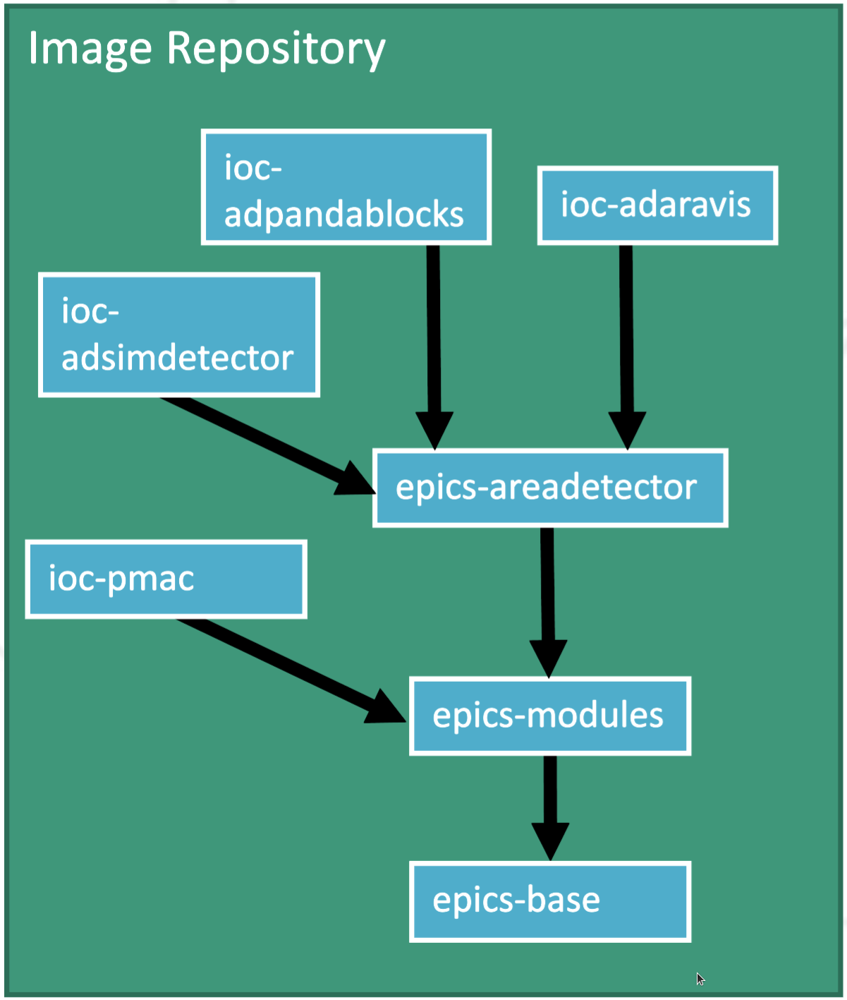

epics-containers
================

|docs_ci| |license|

epics-containers is an experimental GitHub organization to try out ideas
for managing EPICS IOCs in a Kubernetes cluster.

Please contribute with comments and suggestions in the wiki or issues pages:

============== ==============================================================
Documentation  https://epics-containers.github.io
Wiki           https://github.com/epics-containers/epics-containers.github.io/wiki
Issues         https://github.com/epics-containers/epics-containers.github.io/issues
Docs Source    https://github.com/epics-containers/epics-containers.github.io
Organization   https://github.com/epics-containers
============== ==============================================================

.. |docs_ci| image:: https://github.com/epics-containers/k8s-epics-docs/workflows/Docs%20CI/badge.svg?branch=main
    :target: https://github.com/epics-containers/k8s-epics-docs/actions?query=workflow%3A%22Docs+CI%22
    :alt: Docs CI

.. |license| image:: https://img.shields.io/badge/License-Apache%202.0-blue.svg
    :target: https://opensource.org/licenses/Apache-2.0
    :alt: Apache License
    
Communication
=============

If you are interested in discussing containers for control systems, please:

- Add a brief description of your project and the status of it's use of containers to:

  - https://github.com/epics-containers/epics-containers.github.io/wiki/Brief-Overview-of-Projects-Using-Containers-in-Controls
- Email giles.knap@diamond.ac.uk to introduce yourself

We will set up a communication channel soon (after ICALEPCS 2021).

Materials
=========

The following links are to materials presented at the ICALEPCS 2021 Meeting:

  - :download:`ICALEPCS 2021 Paper: Kubernetes for EPICS IOCs<images/THBL04.PDF>`
  - :download:`ICALEPCS 2021 Talk: Kubernetes for EPICS IOCs<images/THBL04_talk.PDF>`

Overview
========

Kubernetes for EPICS IOCs applies modern industry standards to the
management of IOCs.

- Containers package generic IOC code and dependencies.
- Kubernetes orchestrates the **Containers**.
- Helm deploys IOCs to **Kubernetes**.
- Repositories hold **Container** images and **Helm** charts
- CI / CD generates the images, charts from source and delivers them
  to **Repositories**

Below we show how these assets combine to create a running IOC on a
Kubernetes worker node.

.. image:: images/example.png
    :width: 1500px
    :align: center

- The Helm Chart defines an IOC instance as:

  - An image reference for generic IOC binaries
  - A startup Script for the unique IOC instance
  - K8S resource YAML to describe resources to the Kubernetes cluster

- The entire definition of the the example P45 beamline is held in this
  github organization:

  - Helm Charts and IOC Images:

    - https://github.com/orgs/epics-containers/packages

  - BL45P IOC sources:

    - https://github.com/epics-containers/bl45p

The Generic IOC container images are built using a hierarchy with the most
common elements shared as shown in the following diagram:

EPICS base and essential tools are compiled inside one image; the most commonly
used support modules(primarily Asyn) and the AreaDetector framework
also have their own images. Generic IOC images are then
leaves in the hierarchy and are based upon the appropriate dependencies.

..
    Anything below this line is used when viewing README.rst and will be replaced
    when included in index.rst

See https://epics-containers.github.io for more detailed documentation.
