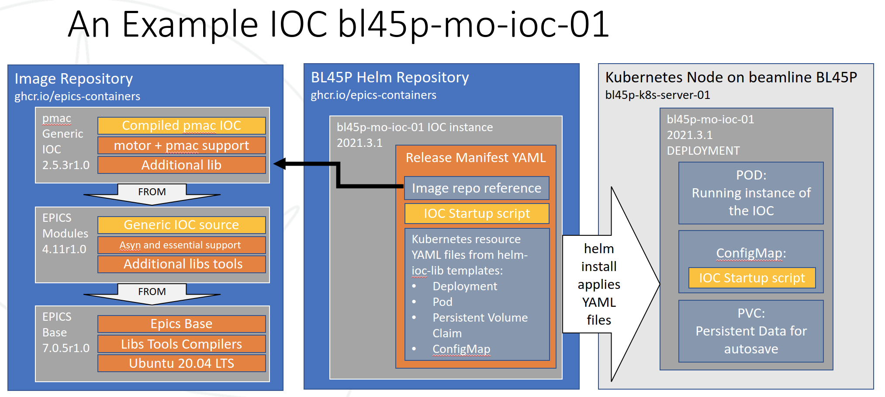

epics-containers
================

|docs_ci| |license|

epics-containers is an experimental GitHub organizaion to try out ideas
for managing EPICS IOCs in a Kubernetes cluster.

============== ==============================================================
Organization   https://github.com/epics-containers
Documentation  https://epics-containers.github.io
Docs Source    https://github.com/epics-containers/epics-containers.github.io
============== ==============================================================

.. |docs_ci| image:: https://github.com/epics-containers/k8s-epics-docs/workflows/Docs%20CI/badge.svg?branch=main
    :target: https://github.com/epics-containers/k8s-epics-docs/actions?query=workflow%3A%22Docs+CI%22
    :alt: Docs CI

.. |license| image:: https://img.shields.io/badge/License-Apache%202.0-blue.svg
    :target: https://opensource.org/licenses/Apache-2.0
    :alt: Apache License

**TODO** include a nice diagram and brief overview

*Placeholder:*

..
    Anything below this line is used when viewing README.rst and will be replaced
    when included in index.rst

See https://epics-containers.github.io for more detailed documentation.
