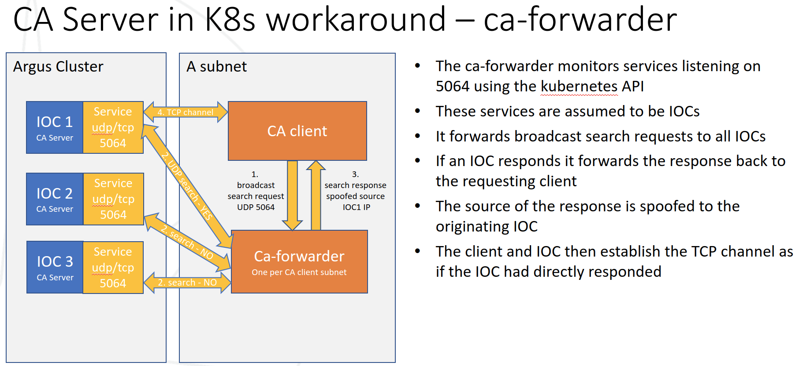

Channel Access and Other Protocols
==================================

Explanations of the challenges and solutions to routing protocols to and
from IOCs running under Kubernetes.

Container Network Interface
---------------------------

A Kubernetes cluster will have a CNI (Container Network Interface) that
provides some form of virtual network within which Pods communicate.

For a useful discussion of this subject see `Kubernetes CNI providers`_

In order to connect to a Pod from outside of the cluster you must configure
a Service. A Service can provide an external IP and port to external clients
and will typically load balance between multiple instances of a given Pod.

In the case of IOCs we only run a single instance but would still normally be
required to configure a service to proxy a connection to our IOC.

The service provides Network Address Translation and routes packets to and
from the Pod and the external client.

Typically CNIs do not support broadcast traffic within their virtual LAN.

.. _Kubernetes CNI providers: https://rancher.com/blog/2019/2019-03-21-comparing-kubernetes-cni-providers-flannel-calico-canal-and-weave/

Problems with CNI
-----------------

The following two behaviours for network protocols are not suitable for use
between an external client and a kubernetes Pod:

- use of broadcast packets
- negotiating an ephemeral port in the application layer (NAT cannot route to
  a such a port since it looks like a new connection)

When prototyping IOCs in Kubernetes we found that the following protocols
had issues for the above reasons:

- Channel Access
- Process Variable Access
- GVSP (Gige Vision Streaming Protocol)

Initially we looked into workarounds to these issues. For example the
diagram below shows a 'ca-forwarder' that sits on the EPICS client subnet
and forwards requests to IOCs in the cluster.

However this 2nd diagram shows why this approach fails when the client is in
the cluster itself.

.. figure:: ../images/cabackwarder.png

The conclusion of this study was that workarounds were fiddly and needed to be
implemented on a per protocol basis, plus there is no guarantee that there
is a solution for all protocols we will need.

Solution - hostNetwork
----------------------
To get round these issues and all possible future network issues we:

- Use remote worker nodes that sit in the beamline subnet
- We use hostNetwork=true which bypasses the CNI and gives Pods direct access
  to the host node's network

This means that, from a networking perspective, all IOCs have identical
status to the traditional IOCs running on beamline servers. When a container
listens on a port it is listening on the IP address of its host and can
receive broadcasts. It can also open new ephemeral ports and a client that
knows the port number can connect because no NAT is in the way.

The downside of this approach is that Pods need elevated privileges in order
to be allowed to use hostNetwork. At DLS the K8S team has implemented a
set of restrictions that mitigate this issue. See `argus` for details
of the remote worker nodes and suggestions for secure configuration.

