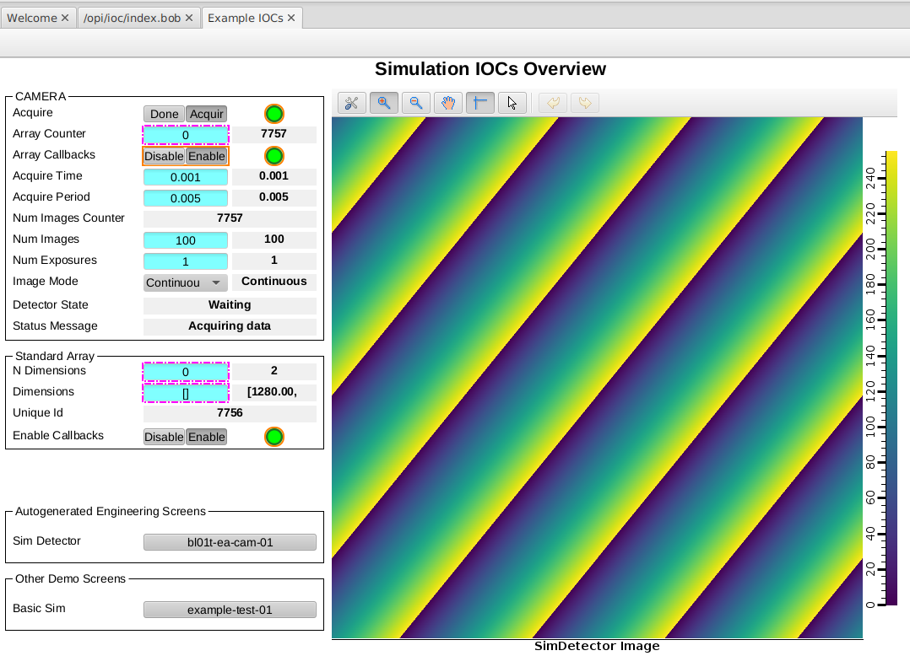

# Developer Containers Part 2

In this tutorial we will take a look at some of the extra features that come with the developer container we built in the previous tutorial.

## Channel Access

If you want to inspect or change PV values for your developer container you can do so using the command line tools inside of the container.

If you still have your previous session open then you can use that. If you need to relaunch your developer container, then you can do so with the following commands:

```bash
cd ioc-adsimdetector
code .
# ctrl-shift-p and choose 'reopen in container'
# open a terminal in vscode

# if the devcontainer has been rebuilt you will need to rebuild the IOC
ibek dev instance /workspaces/t01-services/services/bl01t-ea-cam-01
cd /epics/ioc
make

# otherwise you can go straight to starting the IOC
/epics/ioc/start.sh
```

Now you can open a new terminal in vscode and interact with the IOC using the EPICS CLI tools:

```bash
caget BL01T-EA-CAM-01:DET:Acquire
caput BL01T-EA-CAM-01:DET:Acquire 1
caput BL01T-EA-CAM-01:ARR:EnableCallbacks 1
# now see the (changing) value of the image array
caget -#100 BL01T-EA-CAM-01:ARR:ArrayData
caget -#100 BL01T-EA-CAM-01:ARR:ArrayData
...
```

This just shows that you have all the EPICS tools available to you inside the container.

Note that you have the ability to install any other tools you might need inside the container using `sudo apt update; sudo apt install  package-name`, the container is based on **ubuntu 22.04 LTS** (at time of writing) so all packages available for that distro are available to you. podman users should drop the `sudo` from the start of the commands because podman is already running as root inside the container.


## Auto Port Forwarding

If you want to use a GUI tool such as Phoebus or any other tools outside of your container, they cannot see the container network that your IOC is running in. However this is not an issue because developer containers provide auto port forwarding for you. When you start your IOC it will try to bind to the following ports by default:

- 5064 for Channel Access
- 5065 for the caRepeater
- 5075 for PV Access

When the developer container sees these binds it auto forwards the hosts ports to the IOC's ports. The host binding that is forwarded is to the loopback adapter only, so only the host machine can see the forwarded ports. This is good for development as your PVs are only visible to your workstation.

Once you have started your IOC you can check the ports are forwarded by looking in the PORTS tag of the bottom panel of VSCode. You should see something like this:

:::{figure} ../images/auto-ports.png
Port Forwarding in the bottom panel of VSCode
:::

Note that the caRepeater will only start if it is not already running on the host machine, which is why the image above does not show port 5065.

Because the ports have been forwarded from the host you can use caget *outside* of the container (if you have EPICS tools installed on your host). To do so you must first set the environment up as follows.

```bash
export EPICS_CA_NAME_SERVERS="127.0.0.1:5064"
caget BL01T-EA-CAM-01:DET:Acquire
```

Note that we are using the lesser know `EPICS_CA_NAME_SERVERS` environment variable here. This is because auto port forwarding has not forwarded the udp port required for the EPICS_CA_ADDR_LIST environment variable to work. The `EPICS_CA_NAME_SERVERS` environment variable tells channel access clients to use TCP only. For a detailed explanation of EPICS and container networks see [](../explanations/epics_protocols.md).

## Phoebus

Generic IOCs can use PVI to auto generate engineering screens for your IOC instance in the form of phoebus bob files. ioc-adsimdetector uses this to make screens for the simdetector driver and for all of the AreaDetector plugins installed in the IOC instance.

The ioc-template project supplies a startup script that configures Phoebus correctly and launches it. The script can detect if you have a local install of phoebus and use that, or it can launch a container with phoebus in it when a local install is not found. Next we will run this script to launch phoebus.

IMPORTANT: the commands we are about to run must be executed on the host, not in the developer container. We are looking for a host installed copy of phoebus or we are going to launch a container with phoebus in it. In either case, trying to do that from inside the developer container will fail.

```bash
cd /workspaces/ioc-adsimdetector
./opi/phoebus-launch.sh
```

Phoebus will be launched and attempt to load the bob file called **opi/auto-generated/index.bob**. The **opi** folder is a place where the author of this generic IOC could place some screens. The subfolder **auto-generated** is not committed to git and is where the IOC instance will place its autogenerated engineering screens - this folder is mounted into the container at target **/epics/opis**. The autogenerated screens always include an index.bob which is the entry point to all other autogenerated screens.

## Nicer Overview Screen

The autogenerated engineering screens currently show the image array as a list of integers. But we already had a nice screen for displaying an overview of the PVs, including an image widget for the image array (see {any}`change-the-opi-screen`). That screen was made for the same IOC instance we are currently running inside of the developer container.

To access the screen, chose `File -> Open` in phoebus and navigate to the bob file at  **/workspaces/t01-services/opi/demo-simdet.bob**. If your phoebus is a local install then replace **/workspaces/t01-services** with the path to the **t01-services** repository on your host machine.

This will open the screen in phoebus and allow you to view the sample image.

:::figure

Example overview screen for bl01t-ea-cam-01
:::


