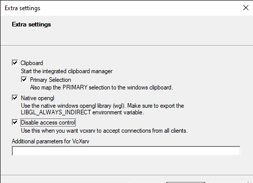

Useful Kubernetes Additions
===========================

For the quickest path through the tutorial use an x86 linux machine
and follow the instructions here `setup_kubernetes`. For additional
options and non-essential features use this page.

Install the Kubernetes Dashboard
--------------------------------

The dashboard gives you a nice GUI for exploring and controlling your cluster.
It is very useful for new users to get an understanding of what Kubernetes
has to offer.

Execute this on your workstation:

.. code-block:: bash

    GITHUB_URL=https://github.com/kubernetes/dashboard/releases
    VERSION_KUBE_DASHBOARD=$(curl -w '%{url_effective}' -I -L -s -S ${GITHUB_URL}/latest -o /dev/null | sed -e 's|.*/||')
    kubectl create -f https://raw.githubusercontent.com/kubernetes/dashboard/${VERSION_KUBE_DASHBOARD}/aio/deploy/recommended.yaml

Then create the admin user and role by executing the following:

.. code-block:: bash

    kubectl apply -f - <<EOF
    apiVersion: v1
    kind: ServiceAccount
    metadata:
      name: admin-user
      namespace: kubernetes-dashboard
    ---
    apiVersion: rbac.authorization.k8s.io/v1
    kind: ClusterRoleBinding
    metadata:
      name: admin-user
    roleRef:
      apiGroup: rbac.authorization.k8s.io
      kind: ClusterRole
      name: cluster-admin
    subjects:
    - kind: ServiceAccount
      name: admin-user
      namespace: kubernetes-dashboard
    EOF

get a token for the user and copy the token into your clipboard::

    kubectl -n kubernetes-dashboard describe secret admin-user-token | grep '^token'

Use kubectl to start a proxy that will forward HTTP requests to your cluster::

    kubectl proxy &

Finally, browse to `Dashboard Screen URL`_ and paste the Token that you copied above:

.. _Dashboard Screen URL: http://localhost:8001/api/v1/namespaces/kubernetes-dashboard/services/https:kubernetes-dashboard:/proxy/#/workloads?namespace=epics-iocs

.. _raspberry:

Installing on a Raspberry Pi
----------------------------

Raspberry Pi3 and Pi4 can run the k3s server. The more memory installed the
better.

We have not worked out how to run the client tools kubectl and helm on the Pi
as yet. You can run these on a separate linux or Windows workstation. There
are arm64 versions of helm and kubectl so we expect that the
`64bit Raspberry Pi OS`_ would be able to run these, but this is untested.

For a Raspberry Pi you need a couple of extra settings to get K3S running::

    sudo update-alternatives --set iptables /usr/sbin/iptables-legacy
    # edit /boot/cmdline and make sure the single line contains:
    #  cgroup_memory=1 cgroup_enable=memory
    sudo reboot

.. _64bit Raspberry Pi OS: https://www.raspberrypi.org/forums/viewtopic.php?t=275370

.. _wsl:

Installing on Windows Subsystem for Linux
-----------------------------------------

WSL2 gives you a linux distribution running within Windows, the following
additional instructions explain how to use this platform.

Install k3s server
~~~~~~~~~~~~~~~~~~

First you need Windows 10 OS build 20262 or higher.
Then follow the `WSL2 instructions`_.
When installing the linux distribution, choose Ubuntu.

Start a new WSL2 Window and bring up the k3s server as follows::

    wget https://github.com/k3s-io/k3s/releases/download/v1.21.2%2Bk3s1/k3s
    sudo install -o root -g root -m 0755 k3s /usr/local/bin/k3s
    sudo k3s server

There are no services in WSL so this k3s server will run in the foreground.
You need to start a second WLS window to continue as follows::

    mkdir .kube
    sudo cp /etc/rancher/k3s/k3s.yaml .kube/config
    sudo chown giles .kube/config

At this point you can return to the main instructions at `install_kubectl`.

Get X11 GUI to Work with WSL
~~~~~~~~~~~~~~~~~~~~~~~~~~~~

When you come to launch the GUI later on you will need some additional steps
as follows.

First you will need install `docker for WSL`_.

You will also require an `X11 Server for Windows`_. When you run the server
choose the option **Disable Access Control** as follows:

The networking for docker on WSL will not broadcast between containers so
you need to use EPICS_CA_ADDR_LIST to get edm to see the example IOC
PVs. To do this perform the following steps to get the name of the
example IOC pod and discover its IP address, then pass that to the
edm container:

cd to the root of the project you created in `deploy_example`, then::

    kubectl get pods
        NAME                      READY   STATUS    RESTARTS   AGE
        example-6779d4dcf-g2cpm   1/1     Running   2          19h

    kubectl exec -it example-6779d4dcf-g2cpm -- busybox ifconfig eth0
        eth0      Link encap:Ethernet  HWaddr 70:85:C2:DB:70:96
                  inet addr:192.168.86.33  Bcast:192.168.86.255  Mask:255.255.255.0

    export DISPLAY=$(awk '/nameserver / {print $2; exit}' /etc/resolv.conf 2>/dev/null):0
    export LIBGL_ALWAYS_INDIRECT=1

    # IP ADDRESS from above kubectl command
    ./opi/stexample-gui.sh -e EPICS_CA_ADDR_LIST=192.168.86.33

.. _WSL2 instructions: https://docs.microsoft.com/en-us/windows/wsl/install-win10
.. _docker for WSL: https://docs.docker.com/docker-for-windows/wsl/
.. _X11 Server for Windows: https://sourceforge.net/projects/vcxsrv/

.. _macos:

Installing on MacOS
-------------------

These instructions have been developed and tested on MacOS version 12.6 Monterey. 

A fundamental requirement is to have the XCode commandline tools installed. This is most easily done by
installing the free XCode App from from the App Store.
Since XCode is a major installation and includes far more that what is strictly required, you can install
*just* the CLI tools with the following Terminal command::

    xcode-select --install

There will be a licece agreement prompt. When installation is complete, verify with ``xcode-select -p`` 
which should return something like ``/Library/Developer/CommandLineTools``.

The relevant tools including docker, K3S, Helm, and others can all be easily installed
and maintained using the `Homebrew`_ package manager. Install ``brew`` with the following Terminal
command::

    /bin/bash -c "$(curl -fsSL https://raw.githubusercontent.com/Homebrew/install/HEAD/install.sh)"

The `Rancher Desktop`_ application is a free alternative to Docker Desktop which packages up
docker and a kubernetes installation in one easy to install app. This also provides a
convenient desktop dashboard where you can monitor and control your kubernetes environment.
Rancher Desktop can be installed with ``brew``::

    brew install --cask rancher

After installation completes, run up the "Rancher Desktop" GUI app which has been installed
into the ``Applications`` folder and MacOS Launchpad. When first starting up the app, you will
be asked to select a "Container Engine" - select the "dockerd (moby)" option in order to use
compatible docker CLI and kubectl commands from this tutorial.

.. _Homebrew: https://brew.sh
.. _Rancher Desktop: https://docs.rancherdesktop.io/

Install other dependencies
~~~~~~~~~~~~~~~~~~~~~~~~~~

A few other dependencies are required in order to follow this tutorial. These are also best installed
and managed by Homebrew::

    brew install coreutils wget

Run commands in bash
~~~~~~~~~~~~~~~~~~~~

The default shell in the Terminal app is ``zsh``. It is similar and largely compatible with ``bash``
but there are some scripts referenced in this documentation that don't work directly in ``zsh``. 
The recommendation for working through the rest of this tutorial/instructions is to start a Terminal
and immidiately run ``bash`` or setup a Terminal profile that runs ``bash`` by default.

A newer version of bash than the one supplied with MacOS can optionally be installed with ``brew install bash``

X11 GUI applications on MacOS
~~~~~~~~~~~~~~~~~~~~~~~~~~~~~

X11 GUI applications like EDM can work on MacOS as well. The `XQuartz`_ project provides an X11 server
for MacOS and can easily be installed with Homebrew::

    brew install --cask xquartz

.. _XQuartz: https://www.xquartz.org
