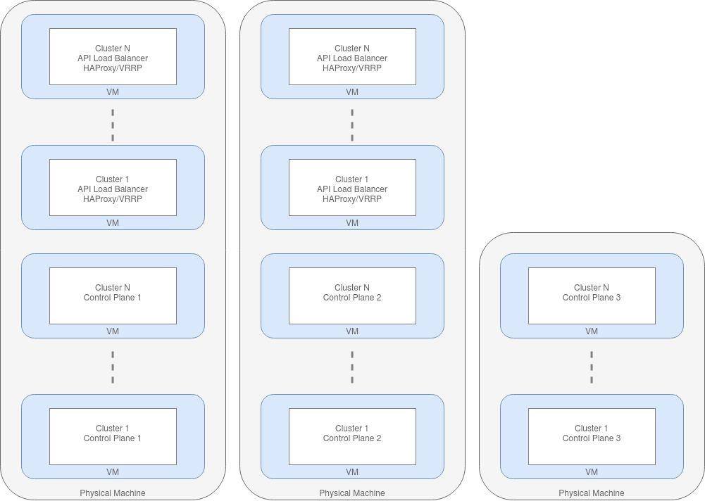
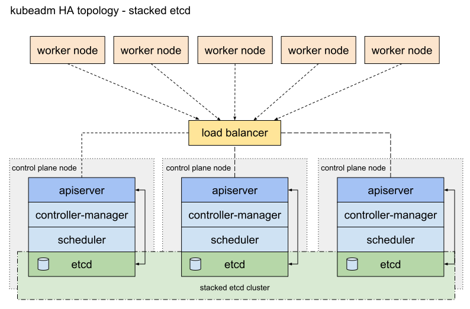

Kubernetes Cluster Config
=========================

Cluster Options
---------------

Three cluster topologies were considered for this project.

:Cluster per beamline:
  This could be as simple as
  a single server: the K3S installation described in
  `setup_kubernetes` may be sufficient. The documentation at
  https://rancher.com/docs/k3s/ also details how to make a high availability
  cluster, requiring a minimum of 4 servers.
  This approach keeps the configuration of the clusters quite straightforward
  but at the cost of having multiple separate clusters to maintain. Also
  it requires control plane servers for every beamline, whereas a centralized
  approach would only need a handful of control plane servers for the entire
  facility.

:Central Facility Cluster:
  A central facility cluster that runs
  all IOCs on its own nodes would keep everything centralized and provide
  economy of scale. However, there are significant issues with routing
  Channel Access, PVA and some device protocols to IOCs running in a
  different subnet to the beamline. DLS spent some time working around these
  issues but eventually abandoned this approach.

:Beamline Worker Nodes:
  This approach uses the central
  cluster but adds remote beamline nodes located in the beamline itself,
  connected to the beamline subnet. This has all the benefits of central
  management but is able to overcome the problems with protocol routing.
  The DLS argus cluster configuration described below is an example of
  how to achieve this.

Current Approach
----------------

DLS is currently investigating Cluster per Beamline as the preferred topology. We
will continue to have a central cluster for shared services but in addition will
have a cluster per beamline and a cluster for the accelerator.

The separate clusters allow us to have separate:

- failure domain
- security domain
- administrative domain
- performance domain

The down side is that we have to manage multiple clusters. There is a lot of
tooling available to help with this, as multi-cluster using cloud providers is
quite a common pattern. We are currently investigating approaches to multi-cluster
management.

.. _argus:

DLS Argus Cluster
-----------------

This section gives details of the topology and special
configuration used by the DLS argus cluster to enable running
IOCs on a Beamline.

Overview
~~~~~~~~

Argus is the production DLS cluster. It comprises 22 bare metal worker nodes, with a 3 node control plane that runs in VMs. The control plane nodes run the K8s master processes such as the API server, controller manager etc. Each control plane node runs an etcd backend.

To load balance across the K8s API running on the control plane nodes, there is a haproxy load balancer. The DNS endpoint argus.api.diamond.ac.uk (which all nodes use as the main API endpoint) points to a single haproxy IP. The IP is HA by virtue of a pair of VMs that both run haproxy, bind on all IPs, and use VRRP/keepalived to make sure the IP is always up. Haproxy has the 3 control plane nodes as a target backend.

The cluster uses Kubeadm to deploy the K8s control plane in containers. It is provided by K8s upstream, and is architecturally similar to Rancher Kubernetes Engine (RKE). Kubeadm supports upgrades/downgrades and easy provisioning of nodes. The cluster is connected using Weave as the CNI. Weave is the only CNI tested that passes Broadcast/Unicast/Multicast (BUM) traffic through the iptables that control network access for pods. Metallb is used as a component to support K8s loadBalancer Service objects. Ingress nginx from nginxinc is used as an ingress controller. Logs are collected from the stdout of all pods using a fluentd daemonset which ships logs to a centralized graylog server. Cluster authentication is via KeyCloak.

The cluster sits in one rack, with a top of rack (TOR) switch/router connecting it to the rest of the network. The cluster nodes sit on the same /22 network which is routable via the TOR router (this router routes the /22 subnet to other racks via OSPF). Metallb pool IPs are allocated from within this /22 to ensure they are globally routable by the OSPF network; the metallb speaker pods respond to ARP requests originating from the TOR router looking for load balanced Service IPs.

**One of the Argus racks**

.. figure:: ../images/argus3.jpg

The cluster is built and managed using Ansible. Heavy use of the k8s module enables direct installation of K8s components by talking directly to the K8s API using the k8s module. Ansible also configures the haproxy API load balancer. Prometheus_operator provides the monitoring stack.

Argus is a multi-tenant cluster. Namespaces are used to enforce multi-tenancy. A namespace is created on demand for each user, acting as a sandbox for them to get familiar with K8s. Applications deployed in production get their own “project” namespace. The project namespace has some associated policy that determines who can run pods in the namespace, what data can be accessed, and if pods can run with elevated privileges. This is enforced by a combination of RBAC and Pod Security Policy (PSP). The latter is a deprecated feature in K8s 1.21 and will soon be replaced with Open Policy Agent.

Beamline Local Cluster Nodes
~~~~~~~~~~~~~~~~~~~~~~~~~~~~

As part of the investigation work some worker nodes in Argus have been connected that are physically located at the beamline. These nodes do not share the same rack as Argus, and hence are part of a different routed subnet to the /22 that the control plane and main workers are within. This model assumes one centralised control plane (and some Generic workers), and a set of beamline cluster nodes that may be distributed across the network (in different subnets).

The beamline cluster nodes require a few interesting sets of configuration to make this architecture work. See the following subheadings for details.

Metallb Pools
+++++++++++++

Metallb cannot be used to provide loadBalancer services for pods running on the beamline cluster nodes. This is because metallb currently only supports a single pool of IPs to allocate from. In the case of Argus, the pool is allocated from within the /22 in which the control plane (and a few Generic workers) sit. Should a pod with a loadBalancer Service IP get brought up on a beamline cluster node, the traffic would not be routable because the beamline TOR switch does not send ARP messages for subnets that it is not directly connected to. This is not an issue running IOCs since they do not make use of loadBalancer Services. There is a feature request for Metallb to support address pools that is currently pending.

Node Labelling and Taints
+++++++++++++++++++++++++

The beamline cluster worker nodes are labelled and tainted with the name of the beamline. This ensures that only pods running IOCs that are relevant to that beamline can be started on the beamline worker nodes. Pods that are to be scheduled there must tolerate the taint, and use node selection based on the label.

Certain utility pods must also tolerate the beamline name taint. Pods such as fluentd (which provides pod log aggregation and shipping to a centralised graylog) need additional tolerations of the taint. However most standard utilities such as Prometheus, Weave (the CNI itself runs in a pod) and kube-proxy all have a toleration of all “noSchedule” taints built in.

Host Network
++++++++++++

In order for IOCs to work within K8s pods, they typically need to see BUM traffic. This is because EPICS uses UDP Broadcast for IOC discovery. There are also other interesting network quirks that IOCs exhibit that make use of the CNI network overlay unsuitable. To get around this, pods running IOCs make use of the host network namespace. In other words, they see the interfaces on the underlying worker nodes, rather than a virtual interface that is connected to the cluster internal network that normal pods see. This is done by setting hostNetwork =  true in the pod spec. Access to the host network namespace requires privileged pods. Whilst this is allowed (Argus uses pod security policy to enforce the attributes of the pods that are scheduled), we do drop the capabilities that are not needed. This reduces the attack surface somewhat. We drop everything except NET_ADMIN and NET_BROADCAST.

Uses for Argus
--------------

The central cluster is used for many services other than EPICS IOCs. Below is
a list of current and potential use cases:

- Controls IOCs
- Kafka and Spark
- Jenkins
- Sonarqube
- Zocalo
- Jupyterhub
- Business apps (Confluence, Jira etc)
- Monitoring stacks (ElasticSearch, Graylog, Graphite, Nagdash etc)
- Core services (LDAP, Kerberos, Gitlab etc)
- Netbox
- MariaDB
- HT Condor
- Machine Learning toolkits (Kubeflow)
- VM orchestration (Kubevirt/Virtlet)
- Relion
- Storage Systems deployment (Ceph-rook, Portworkx etc)
- XChem Fragalysis
