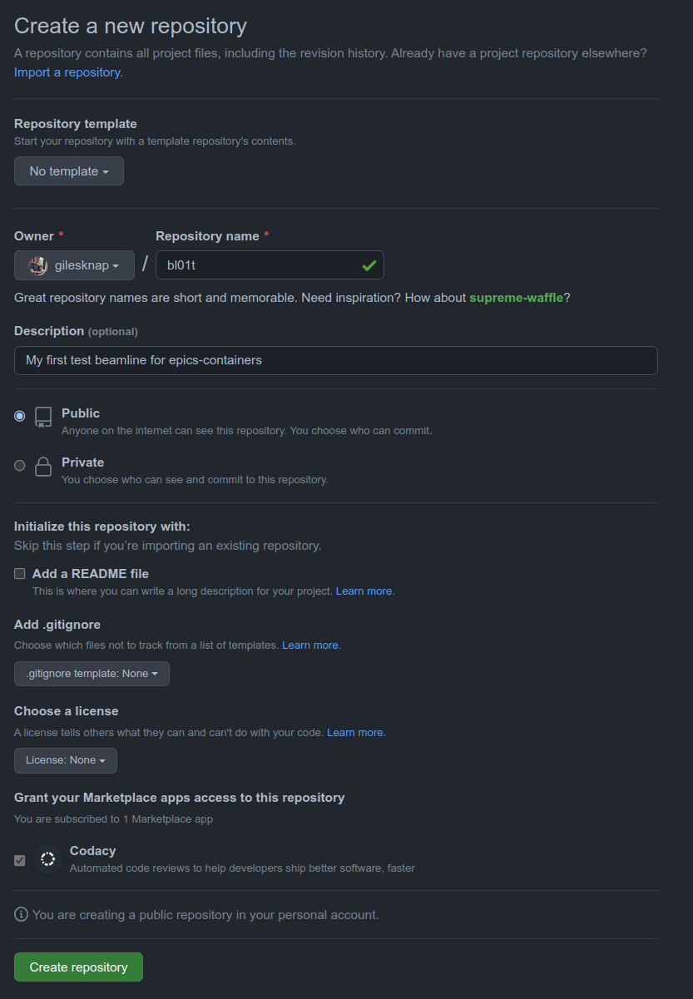

.. _create_beamline:

Create a beamline repository
============================

In this tutorial we will create a new beamline source repository.

All IOCs that we deploy to the cluster will be grouped into domains and each
domain will have its own repository for the source code of the IOC instances
that it contains.

In the case of Beamlines, the domain is the beamline itself. Here
we use the naming convention ``blxxc`` where ``xx`` is the beamline number,
and c is the class of beamline. For example ``bl01t`` is the beamline 1,
type test.

.. note::

    You may choose your own naming convention, but lower case letters,
    numbers and hyphens only are recommended for both domain names and
    IOC names. This is a restriction that helm introduces for package names.

In this tutorial we will create the test beamline repository ``bl01t``.
When the project ``bl01t`` is pushed to GitHub, continuous integration will
generate helm charts for each IOC instance it defines
and push them to your GitHub account's OCI registry.

The beamline will come with a single example IOC and further steps in the
following tutorials will teach you how to add your own.

For accelerator domains the approach described here will be identical. The
only difference is that IOCs are split by domain rather than by beamline.
A different naming convention will be used for accelerator domains (to be
determined).

To Start
--------

For this exercise you will require a github user account or organization in
which to place the new repo. If you do not have one then follow GitHub's
`instructions`_.

Log in to your account by going here https://github.com/login.

.. _instructions: https://docs.github.com/en/get-started/signing-up-for-github/signing-up-for-a-new-github-account

You will also need to setup ssh keys to authenticate to github from git. See
`about ssh`_.

Create a New Repository
-----------------------

Here we will copy the beamline template repository, change it's name (and the
name of the example IOC) and push it back to our own new GitHub repo.

IMPORTANT: for this tutorial we will use your personal GitHub Account to
store everything we do, including the helm charts and container images. For
production, each facility will need its own policy for where to store these
assets. See `../explanations/repositories`.

TODO: these steps could be automated in an epics-containers-cli command for
generating new domain repos (also do one for new generic ioc repos).

STEPS::

    1. Create a new, completely blank repository in your GitHub account, this
       should be called ``bl01t``.

    2. Clone the repo locally and rename from blxxi-template to bl01t

    .. code-block:: bash

        git clone git@github.com:epics-containers/blxxi-template.git
        mv blxxi-template.git bl01t
        cd bl01t
        mv iocs/blxxi-ea-ioc-01/ iocs/bl01t-ea-ioc-01
        sed -i 's/blxxi/bl01t/g' $(find *)

First create a new, completely blank repository in your GitHub account, this
should be called ``bl01t``.

Navigate to the beamline template repo here
https://github.com/epics-containers/blxxi-template
Click on 'Use This Template'. Choose a name and description for your repo.
Click 'Create Repository From Template'.

This will create your new repository and take you to its Code panel.

Now Click on 'Code' and copy the SSH link presented.

.. _about ssh: https://docs.github.com/en/enterprise-server@3.0/github/authenticating-to-github/connecting-to-github-with-ssh/about-ssh

Clone and Tag the Repository
----------------------------

NOTE: For the remainder of the tutorial you will use the project you
created in `Create a New Repository`_. You need to substitute in your account
details to the commands listed here.

In a terminal use git to clone the repository by pasting in the URL you copied
in the previous step::

    git clone git@github.com:<your account or organization>/bl01t.git

Now test that CI is working by tagging the repo and pushing it back to github.

cd to the root of the project you created in `05_deploy_example`, then::

    git tag 0.1
    git push origin 0.1

This will cause github CI to generate a helm chart for the example IOC and
deliver it to the account packages repository.

To watch the progress go to the Actions Panel for your project.

.. image:: ../images/github_actions.png
    :align: center

Once the CI completes you should have a helm chart delivered in your packages.
Go to the code pane and click on the example Package circled below to see it.

.. image:: ../images/github_package.png
    :align: center

There will be one version of the package, with two tags:

- the tag you set on the source
- and the 'latest' tag

Notes For Writing this Tutorial
-------------------------------

I deployed and ran blxxi as follows:

.. code-block:: bash

    # get the source (for the edm gui only - not needed for deployment)
    git clone git@github.com:epics-containers/blxxi-template.git
    cd blxxi-template/opi

    # deploy to the currently configured default beamline
    ec ioc deploy blxxi-ea-ioc-01 23.3.2

    # find the ip address of the pod if its not in your subnet
    ec ps -w

    # launch edm
    export EPICS_CA_ADDR_LIST=172.23.168.23
    ./blxxi-ea-ioc-01-gui.sh

    # launch PVA image viewer
    export EPICS_PVA_ADDR_LIST=172.23.168.23
    c2dv --pv BLXXI-EA-TST-01:IMAGE