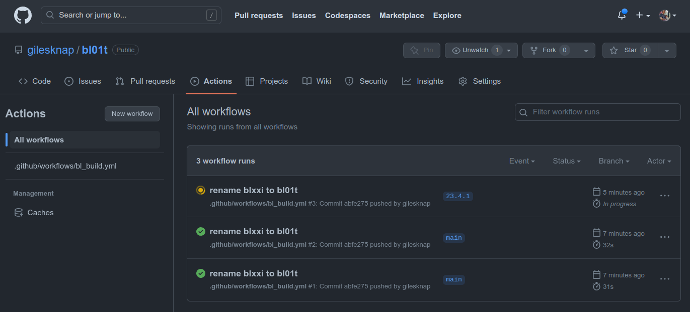
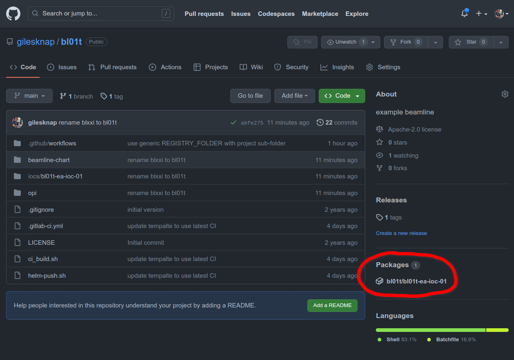

.. _create_beamline:

Create a Beamline Repository
============================

In this tutorial we will create a new beamline source repository.

All IOCs that we deploy to the cluster will be grouped into domains and each
domain will have its own repository for the source code of the IOC instances
that it contains.

In the case of Beamlines, the domain is the beamline itself. Here
we use the naming convention ``blxxc`` where ``xx`` is the beamline number,
and c is the class of beamline. For example ``bl01t`` is the beamline 1,
type test.

.. note::

    You may choose your own naming convention, but lower case letters,
    numbers and hyphens only are recommended for both domain names and
    IOC names. This is a restriction that helm introduces for package names.

In this tutorial we will create the test beamline repository ``bl01t``.
When the project ``bl01t`` is pushed to GitHub, continuous integration will
generate helm charts for each IOC instance it defines
and push them to your GitHub account's OCI registry.

The beamline will come with a single example IOC and further steps in the
following tutorials will teach you how to add your own.

For accelerator domains the approach described here will be identical. The
only difference is that IOCs are split by domain rather than by beamline.
A different naming convention will be used for accelerator domains (to be
determined).

To Start
--------

For this exercise you will require a github user account or organization in
which to place the new repo. If you do not have one then follow GitHub's
`instructions`_.

Log in to your account by going here https://github.com/login.

You will also need to setup ssh keys to authenticate to github from git. See
`about ssh`_.

.. _instructions: https://docs.github.com/en/get-started/signing-up-for-github/signing-up-for-a-new-github-account
.. _about ssh: https://docs.github.com/en/enterprise-server@3.0/github/authenticating-to-github/connecting-to-github-with-ssh/about-ssh

Create a New Repository
-----------------------

Here we will copy the beamline template repository, change it's name (and the
name of the example IOC) and push it back to our own new GitHub repo.

IMPORTANT: for this tutorial we will use your personal GitHub Account to
store everything we do, including the helm charts and container images. For
production, each facility will need its own policy for where to store these
assets. See `../explanations/repositories`.

TODO: these steps could be automated in an epics-containers-cli command for
generating new domain repos (also do one for new generic ioc repos).

STEPS
~~~~~

These steps ensure that your new repo shares its git history with the
template repo, so that you can easily pull in changes from the template
repo in the future.

#.  Create a new, completely blank repository in your GitHub account
    called ``bl01t``. To do this go to https://github.com/new
    and fill in the details as per the image below. Click
    ``Create repository``.

#.  Clone the template repo locally and rename from blxxi-template to bl01t

    .. code-block:: bash

        git clone git@github.com:epics-containers/blxxi-template.git
        mv blxxi-template bl01t
        cd bl01t
        mv iocs/blxxi-ea-ioc-01/ iocs/bl01t-ea-ioc-01
        mv opi/blxxi-ea-ioc-01/ opi/bl01t-ea-ioc-01
        # careful to use find *, NOT find . or you will change the .git folder
        sed -i s/blxxi/bl01t/g $(find * -type f)
        # use your username as the prefix to all PV names
        # this ensures multiple simultaneous users do not clash
        sed -i s/BLXXI/$USER/g $(find * -type f)

    .. note::

        If you are sharing the bl01t namespace on a cluster with other users
        (e.g. if you are at **DLS**) then change the name of your IOC
        to something unique. To do this rename the folder iocs/bl01t-ea-ioc-01
        to your unique name and edit the ``name:`` field at the top of
        ``Chart.yaml`` to match the folder name. The suggested name is your
        username as the prefix e.g. hgv27681-ea-ioc-01.

        If you do this - remember to substitute in your own name in the
        following steps, replacing bl01t-ea-ioc-01.

#.  Add your new repo to your VSCode workspace and take a look at what you
    have.

    From the VSCode menus: File->Add Folder to Workspace
    then select the folder bl01t

#.  Push the new repo back to a the new repo on github

    .. code-block:: bash

        git remote rm origin
        git remote add origin git@github.com:<YOUR USER NAME>/bl01t.git
        git add .
        git commit -m "rename blxxi to bl01t"
        git push --set-upstream origin main

    As this is your first commit you may find that you need to set your
    username and email address for git. If so, follow the instructions
    that git gives you. In theory this should be handled for you by
    vscode devcontainers but this does not always work.
    See `git in vscode`_.

.. _git in vscode: https://code.visualstudio.com/remote/advancedcontainers/sharing-git-credentials

.. figure:: ../images/create_repo.png

Note that creating your project in this way means it is possible to
synchronize changes from the original blxxi-template project.
See `../how-to/update_templated`.

Make a Release of Example Beamline bl01t
----------------------------------------

To make a release of the project we defined in `deploy_example`,
we will
tag your repo with a calendar based version number see (https://calver.org/).

We use YY.MM.MINOR for versioning things like beamlines and generic IOCs. You
can choose your own scheme, but because these projects do not have APIs as
such it is more instructive to use a date based scheme.

The example version below was the first revision in the month of April 2023.

.. code-block:: bash

    cd bl01t
    git tag 23.4.1
    # push the tag
    git push origin 23.4.1

This will cause GitHub to create a release of the project and trigger
continuous integration. The continuous integration will look at all of
the IOCs in the beamline and generate helm charts for each one. If the helm
chart has changed since the last release then a new version of the helm chart
is delivered to your GitHub account's OCI registry.

To watch the progress go to the Actions Panel for your project at
https://github.com/<YOUR USER NAME>/bl01t/actions

Once the CI completes you should have a helm chart delivered in your project
OCI registry. You can see this listed in project 'packages'.
Look for a link to the package on the right hand side of your
project page.

Go to the code pane and click on the example package circled below to see it.

The OCI registry name of the helm chart will be
ghcr.io/<YOUR USER NAME>/bl01t/bl01t-ea-ioc-01:23.4.1.

You have now completed this tutorial. Here you have created a new beamline
repository and made a release of it. The release includes the example IOCs
instance called ``bl01t-ea-ioc-01``. This IOC has had a helm chart generated
for it and published ready for deployment to your cluster.

In the next tutorial we will look into what we have created in more detail
and we will deploy and test the new example IOC.

For details of what goes into the helm chart of an IOC instance see
`../reference/ioc_helm_chart`.
