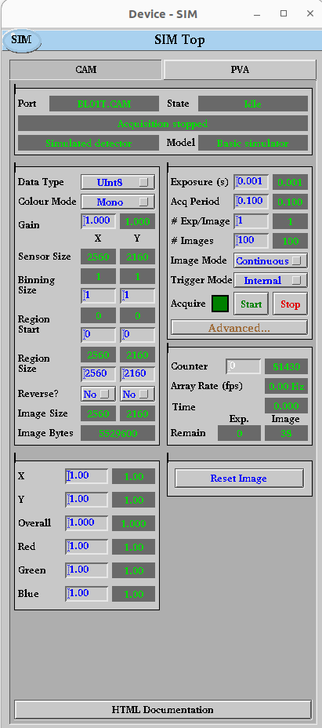
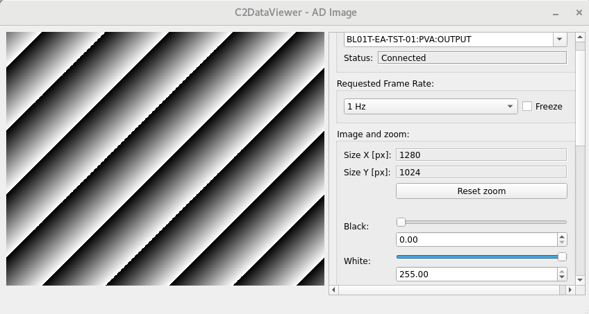

Deploy The Example IOC
======================

Deploy the IOC Instance to Kubernetes
-------------------------------------

For this tutorial we are going to work with the example IOC bl01t-ea-ioc-01
that came with our beamline repository from the previous tutorial.
Here we will deploy the IOC into our cluster and then learn how to interact
with it.

If you are interested in the detail of what is in the bl01t-ea-ioc-01 folder
that describes this IOC instance then see: `../reference/ioc_helm_chart`.

Also, if you are interested in how the helm chart manifests itself in your
cluster when deployed then see: `../reference/k8s_resources`.

For this section we will be making use of the epics-containers-cli tool. This makes
it easier to interact with kubernetes and helm from the command line and is
described in more detail here: `CLI`.

You will need a working Kubernetes cluster for most of the rest of the
tutorials. You can verify that it is working by asking for a list of IOCs
running in your default domain as follows:

.. code-block:: bash

    ec ps

You should see some headings and an empty list as you have not yet started an
IOC Instance.

.. note::

    The command ``ec`` is the epics-containers command line utilities entry
    point. For more information see `CLI` or try ``ec --help``.

The following command will deploy the example IOC instance to your cluster
(if you changed the ioc name in the previous tutorial then
remember to change bl01t-ea-ioc-01 to your unique name here):

.. code-block:: bash

    ec ioc deploy bl01t-ea-ioc-01 23.4.1

Note that this is looking for the IOC's helm chart in your OCI helm registry.
You delivered the IOC helm chart to the registry when you made a release of
the beamline repo in the previous tutorial. You must supply a version number
that exists. If you do not recall the version number you used in the last tutorial,
you can use the following command to list the versions available in your
registry:

.. code-block:: bash

    ec ioc versions bl01t-ea-ioc-01

As the deployment is progressing you could use the following command to
monitor the progress (hit ctrl-C to stop following the logs):

.. code-block:: bash

    ec ioc logs bl01t-ea-ioc-01 -f

Note there may be a little delay while the cluster pulls the generic IOC
image from the GitHub container registry. The error
"recGblRecordError: devStringinEnvVar (init_record) Illegal INP parm field Illegal field value PV: BL01T-EA-IOC-01:TIMEZONE"
is benign, TODO: take a look at the cause of this error.

Once the IOC is running you can find out the IP address of the pod it is
running in with:

.. code-block:: bash

    ec ps -w

This will show you the status of the IOC instance and the IP address of the
pod it is running in. In a real beamline setup the IOCs would run in the same
subnet as your workstation so you would not care about the IP address. But
for the example you may need to do the following to let our EPICS clients
know where to look for PVs:

.. code-block:: bash

    export EPICS_CA_ADDR_LIST=ip_address_of_pod
    export EPICS_PVA_ADDR_LIST=ip_address_of_pod

epics-containers does not yet have any provision for EPICS operator interfaces.
For this example we have hand crafted some EDM screens to control and monitor
the test IOC. These EDM screens are supplied in the template so you will
have them in the ``opi`` folder in your beamline repository.

You can now launch the client applications as follows:

.. code-block:: bash

    ./blxxi-ea-ioc-01-gui.sh
    c2dv --pv $USER-EA-TST-01:IMAGE

Now make sure the AreaDetector is Acquiring by clicking Start if needed on
the CAM screen. Next click on Auto to scale the
black and white thresholds on the C2D viewer. You should see something like the
following images.

.. note::

    When you launch edm or c2dv for the first time you
    will see container images downloading, for an explanation of this see
    `../explanations/cli-tools`

    edm screen for the example IOC

    the c2dv viewer showing an image from the example IOC

Managing IOCs
--------------

IOCs running in Kubernetes can be managed using the ``ec`` command.

Starting and Stopping IOCs
~~~~~~~~~~~~~~~~~~~~~~~~~~

To stop / start  the example IOC:

.. code-block:: bash

    ec ioc stop bl01t-ea-ioc-01
    ec ioc start bl01t-ea-ioc-01

Monitoring and interacting with an IOC shell
~~~~~~~~~~~~~~~~~~~~~~~~~~~~~~~~~~~~~~~~~~~~

To attach to the ioc shell:

.. code-block:: bash

    ec ioc attach bl01t-ea-ioc-01

Use the command sequence ctrl-P then ctrl-Q to detach or ctrl-D to restart the
IOC and detach.

TODO: I'm having issues with the shell eating the ^P^Q sequences so
at present you can only detach from the IOC by killing the terminal or
using ^D.

To run a bash shell inside the IOC container:

.. code-block:: bash

    ec ioc exec bl01t-ea-ioc-01

Once you have a shell inside the container you can inspect the following
folders:

=============== ==============================================================
ioc code        repos/epics/ioc
support modules repos/epics/support
epics binaries  repos/epics/epics-base
=============== ==============================================================

Logging
~~~~~~~

To get the current logs for the example IOC:

.. code-block:: bash

    ec ioc logs bl01t-ea-ioc-01

Or follow the IOC log until you hit ctrl-C:

.. code-block:: bash

    ec ioc logs bl01t-ea-ioc-01 -f

