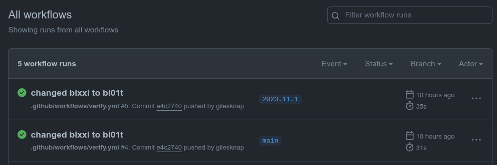

Deploying and Managing IOC Instances
====================================

Introduction
------------

This tutorial will show you how to deploy and manage the example IOC Instance
that came with the template beamline repository.
You will need to have your own ``bl01t`` beamline repository
from the previous tutorial.

For these early tutorials we are not using Kubernetes and instead are deploying
IOCs to the local docker or podman instance. So for these tutorials we
shall pretend that your workstation is one of the IOC servers on the fictitious
beamline ``BL01T``.

Continuous Integration
----------------------

Before we change anything, we shall make sure that the beamline repository CI
is working as expected. To do this go to the following URL (make sure you insert
your GitHub account name where indicated):

.. code::

    git@github.com:**YOUR GITHUB ACCOUNT**/bl01t/actions

You should see something like the following:

    the GitHub Actions page for the example beamline repository

This is a list of all the Continuous Integration (CI) jobs that have been
executed (or are executing) for your beamline repository. There should be
two jobs listed, one for when you pushed the main branch and one for when you
tagged with the ``CalVer`` version number.

If you click on the most recent job you can drill in and see the steps that
were executed. The most interesting step is ``Run bash ./ci_verify.sh``. This
is executing the script in the root of your beamline repository that verifies
each IOC instance in the ``iocs`` folder. In future we can make this script
more sophisticated when we have simulated hardware to test against.

For the moment just check that your CI passed and if not review that you
have followed the instructions in the previous tutorial correctly.

Set up Environment for BL01T Beamline
-------------------------------------

The standard way to set up your environment for any domain is to get
the environment.sh script from the domain repository and source it.

First make sure you have the local binaries folder in your path by adding
the following to the end of you $HOME/.bash_profile file:

.. code-block:: bash

    export PATH="$PATH:~/.local/bin"

Then follow these steps (make sure you insert your GitHub account name
where indicated):

.. code-block:: bash

    cd /tmp
    curl -o ~/.local/bin/bl01t https://raw.githubusercontent.com/**YOUR GITHUB ACCOUNT**/bl01t/main/environment.sh?token=$(date +%s)
    source ~/.bash_profile
    source bl01t

Once you have done this and logged out and back in again to pick up your new
profile you should be able to enable the ``bl01t`` environment as follows:

.. code-block:: bash

    # first make sure you have loaded your virtual environment
    source $HOME/ec-venv/bin/activate
    source bl01t

Deploy the Example IOC Instance
-------------------------------

For this section we will be making use of the epics-containers-cli tool.
This command line entry point for the tool is ``ec``. For more
details see: `CLI` or try ``ec --help``.

The simplest command to check that the tool is working is ``ps`` which lists
the IOC Instances that are currently running:

.. code-block:: bash

    ec ps

You should see some headings and an empty list as you have not yet started an
IOC Instance.

The following command will deploy the example IOC instance to your local
machine (unless you have skipped ahead and set up your Kubernetes config
in which case the same command will deploy to your Kubernetes cluster).

.. code-block:: bash

    cd bl01t # (if you are not already in your beamline repo)
    ec ioc deploy-local iocs/bl01t-ea-ioc-01

You will be prompted to say that this is a *TEMPORARY* deployment. This is
because we are deploying directly from the local filesystem. You should only
use this for testing purposes because there is no guarantee that you could
ever roll back to this version of the IOC (as it is lost as soon as filesystem
changes are made). Local filesystem deployments are given a beta version
number to indicate that they are not permanent.

You can now see the beta IOC instance running with:

.. code-block:: bash

    $ ec ps
    IOC NAME            VERSION             STATUS              IMAGE
    bl01t-ea-ioc-01     2023.10.26-b11.53   Up 6 minutes        ghcr.io/epics-containers/ioc-adsimdetector-linux-runtime:2023.10.5

At the end of the last tutorial we tagged the beamline repository with a
``CalVer`` version number and pushed it up to GitHub. This means that we
can now release the IOC instance with that same version number. First let's
check that the IOC instance version is available as expected:

.. code-block:: bash

    $ ec ioc instances bl01t-ea-ioc-01
    Available instance versions for bl01t-ea-ioc-01:
        2023.11.1

.. note::

    The above command is the first one to look at your github repository.
    This is how it finds out the versions
    of the IOC instance that are available. If you get an error it may be
    because you set EC_DOMAIN_REPO incorrectly in environment.sh. Check it
    and source it again to pick up any changes.

Now that we know the latest version number we can deploy a release version.
This command will extract the IOC instance using the tag from GitHub and deploy
it to your local machine:

.. code-block:: bash

    $ ec ioc deploy bl01t-ea-ioc-01 2023.11.1
    bdbd155d437361fe88bce0faa0ddd3cd225a9026287ac5e73545aeb4ab3a67e9

    $ ec ps
    IOC NAME            VERSION             STATUS              IMAGE
    bl01t-ea-ioc-01     2023.11.1           Up 4 seconds        ghcr.io/epics-containers/ioc-adsimdetector-linux-runtime:2023.10.5

Managing the Example IOC Instance
---------------------------------

Starting and Stopping IOCs
~~~~~~~~~~~~~~~~~~~~~~~~~~

To stop / start the example IOC try the following commands. Note that
``ec ps -a`` shows you all IOCs including stopped ones.

.. code-block:: bash

    ec ps -a
    ec ioc stop bl01t-ea-ioc-01
    ec ps -a
    ec ioc start bl01t-ea-ioc-01
    ec ps

.. Note::

    Generic IOCs.

    You may have noticed that the IOC instance has is showing that it has
    an image ``ghcr.io/epics-containers/ioc-adsimdetector-linux-runtime:2023.10.5``.

    This is a Generic IOC image and all IOC Instances must be based upon one
    of these images. This IOC instance has no startup script and is therefore
    not functional, it could have been based on any Generic IOC.

Monitoring and interacting with an IOC shell
~~~~~~~~~~~~~~~~~~~~~~~~~~~~~~~~~~~~~~~~~~~~

To attach to the IOC shell you can use the following command. HOWEVER, this
will attach you to nothing in the case of this example IOC as it has no
shell. In the next tutorial we will use this command to interact with
iocShell.

.. code-block:: bash

    ec ioc attach bl01t-ea-ioc-01

Use the command sequence ctrl-P then ctrl-Q to detach from the IOC
You can also usually restart and detach from the IOC using ctrl-D or
ctrl-C.

To run a bash shell inside the IOC container:

.. code-block:: bash

    ec ioc exec bl01t-ea-ioc-01

Once you have a shell inside the container you could inspect the following
folders:

=============== ==============================================================
ioc code        /epics/ioc
support modules /epics/support
EPICS binaries  /epics/epics-base
=============== ==============================================================

Logging
~~~~~~~

To get the current logs for the example IOC:

.. code-block:: bash

    ec ioc logs bl01t-ea-ioc-01

Or follow the IOC log until you hit ctrl-C:

.. code-block:: bash

    ec ioc logs bl01t-ea-ioc-01 -f

You will notice that this IOC simply prints out a message regarding what
you can place in the /epics/ioc/config folder. In the next tutorial
we will look at how to configure a real EPICS IOC.

