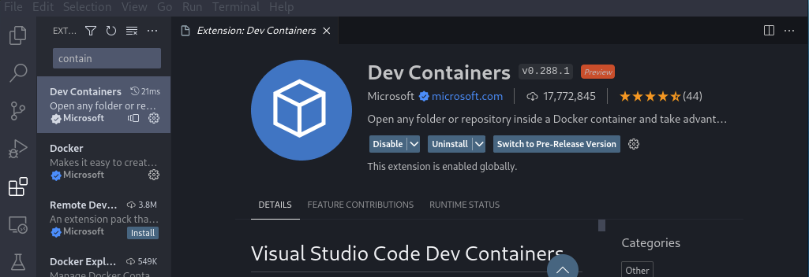
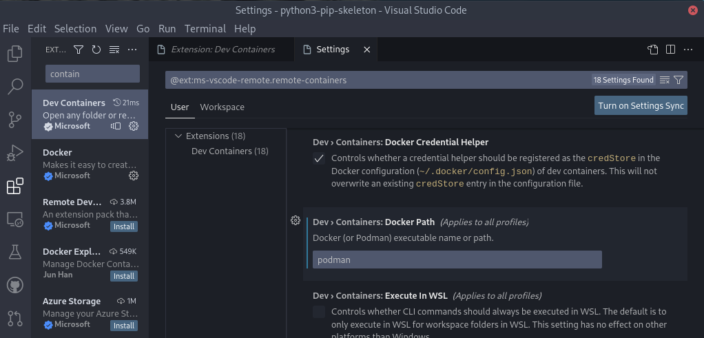
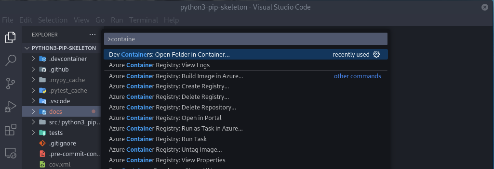

Setup a Devcontainer
====================

Introduction
------------

The devcontainer provides the environment in which you will do all your development.
This is a basic tutorial that introduces the concept in preparation for the
epics devcontainer tutorial.

.. seealso:: `epics_devcontainer`

Configure Visual Studio Code
----------------------------

You must ensure you have the devcontainer plugin. This is installed as part
of `Remote Development`_ in the previous tutorial:

    devcontainer plugin

.. _Remote Development: https://marketplace.visualstudio.com/items?itemName=ms-vscode-remote.vscode-remote-extensionpack

For podman users, you must first tell VSCode to use podman instead of docker.
Open a VSCode window and hit "ctrl ," (control-comma) to open the user
settings editor and search for
"dev.containers.dockerPath", change its value from "docker" to "podman".

    devcontainer podman setting

Launching the Devcontainer
--------------------------

If your repository contains a ``.devcontainer`` directory, vscode will be
able to follow the instructions inside and launch a container.

.. code-block:: bash

    git clone <repo>
    cd <repo>
    code .

This will open the project folder in Visual Studio Code. You will be prompted
to reopen the folder in a container. Click on the ``Reopen in Container`` button.

.. figure:: ../images/vscode-reopen-in-container.png
    :width: 600px
    :align: center

    reopen in container dialogue

You can also access the command via the CTRL+SHIFT+P menu:

    devcontainer launch option

Now all of your VSCode terminals and file explorer will be running inside of
the devcontainer and have access to all the tools installed there.
