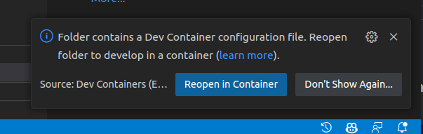

Setup a Devcontainer
====================

Introduction
------------

The devcontainer provides the environment in which you will do all your development.

Configure Visual Studio Code
----------------------------

You must ensure you have the devcontainer plugin:

    devcontainer plugin

For podman users, you must first tell VSCode to use podman instead of docker.
Open a VSCode window and hit "ctrl ," (control-comma) to open the user
settings editor and search for
"dev.containers.dockerPath", change its value from "docker" to "podman".

.. figure:: ../images/dev-container-settings.png
    :width: 600px
    :align: center

    devcontainer podman setting

Launching the Devcontainer
--------------------------

To setup your devcontainer, perform the following steps:

-  create a workspace folder
-  clone the .devcontainer repository into the workspace folder
-  open the workspace folder with Visual Studio Code.

for example:

.. code-block:: bash

    mkdir work-ec
    cd work-ec
    git clone git@github.com:epics-containers/.devcontainer.git
    code .

This will open the workspace folder in Visual Studio Code. You will be prompted
to reopen the folder in a container. Click on the ``Reopen in Container`` button.

    reopen in container dialogue

You can also access the command via the CTRL+SHIFT+P menu:

.. figure:: ../images/dev-container.png
    :width: 600px
    :align: center

    devcontainer launch option

Now all of your VSCode terminals and file explorer will be running inside of
the devcontainer and have access to all the tools installed there.
