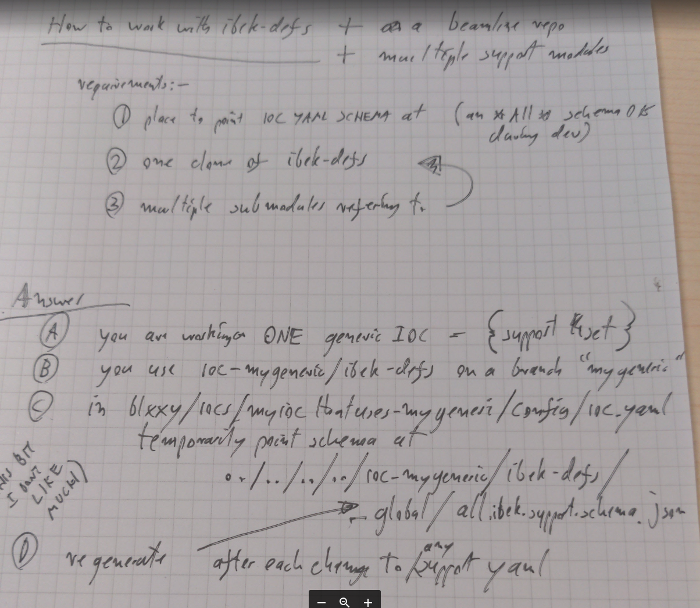

Defining IOC Instances using IBEK
=================================

.. warning::

    This page is work in progress. It is currently just some loose notes.

TODO: do some of these titles belong in explanations or reference sections? If so then the tutorial will need to reference them at the start.

What is IBEK
------------

- IOC Builder for EPICS on Kubernetes
- uses Support YAML to define what each support module can supply
- uses IOC YAML to instantiate instances of support features that make up an IOC instances

Why Use IBEK
------------

- saves on typing of substitution files
- provides a level of verification at build time
- encapsulates knowledge of each support module within module
- etc.

Alternatives
------------

epics-containers supports out of the box dropping a startup script and
substitution file into the config folder as an alternative to supplying
ibek IOC YAML. But you can override start.sh and work in any way you choose
at runtime.

ibek-defs
---------

- defines the support modules YAML in a single place.
- exists to avoid duplication of support module definitions
- and to avoid working on multiple support modules while kicking off epics-containers
- in future YAML could be supplied in each support module itself - but until epics-containers is widely used, this is a good way to get started
- the ibek-defs repo is added as a git-submodule to every Generic ioc (ioc-xxx) repo and in this ensures that a rebuild of a Generic ioc will be with a consistent set of YAML files until a developer explicitly updates the submodule.

How to work on ibek-defs
------------------------

Building a new Generic ioc and making it compatible with ibek means creating ibek support YAML for all of its dependent support modules (where they do not already exist)

These steps assume you have a Generic ioc for ADUrl based on ioc_template as discussed in `generic_ioc`.
Your Generic ioc has a default ioc instance used for testing.
In ioc/config/st.cmd we have a default startup script for the example IOC.
To work on ibek support we will remove this file and replace it with ``ioc.yaml``.
We already have a git submodule for ibek-defs which we used for accessing patch files
during build, this will also be used for creating and editing support yaml files.

TODO: this will become a concrete example for walking through as a tutorial with ioc-adurl.

NOTE: these steps are for building and testing the example IOC that comes with
the Generic ioc template. This will break the system test and that would need
to be updated accordingly. To just work on ibek support files using an external
ioc instance YAML file see `../how-to/ibek-defs` (I probably need to combine
these two pages into something coherent).

STEPS:

- remove ioc/config/st.cmd and create ioc/config/ioc.yaml
- cd ibek-defs
- git checkout -b my-working-branch
- cd ..
- add useful yaml definitions to ibek-defs/<a support module>/<a support module>.yaml
- add some entities that use those definitions to ioc/config/ioc.yaml
- TODO need to make dev launch mount ioc folder into the container - avoiding build step and giving us a tight inner dev loop
  - (whereas dev ioc-launch mounts in the config of an IOC instance - MAYBE this is confusing or these commands need better names?)
- ec dev build
- ec dev launch
- inside the container:
  - cd /repos/epics/ioc
  - start.sh

   ibek-defs

