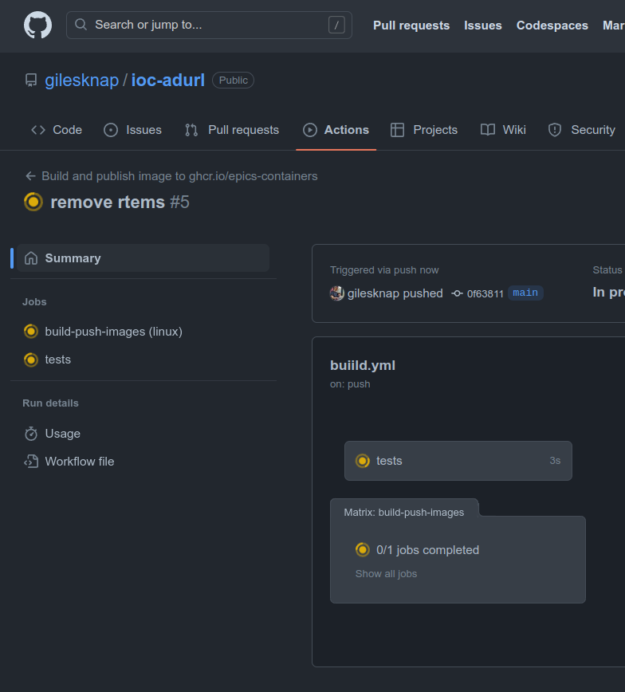
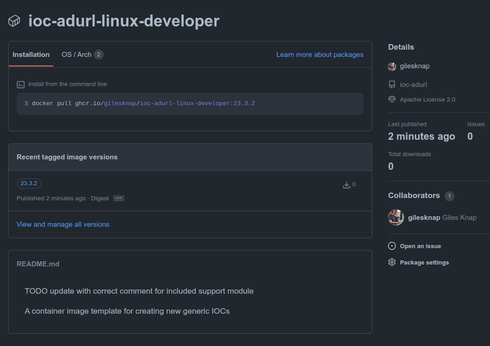

Testing and Deploying a Generic IOC
===================================

Continuous Integration
----------------------

An important feature of epics-containers is CI. The ioc-template that we
based ioc-adurl upon has built-in CI for GitHub (and DLS internal GitLab).

The first thing we will do is get the project pushed up to GitHub and
verify that the CI is working.

Before pushing the project we must push our changes to the submodule ibek-defs,
then we can push the main project to GitHub too:

.. code-block:: bash

    cd ibek-defs
    git add .
    git commit -m "Added ADURL"
    git push
    cd ..
    git add .
    git commit -m "update the template to ADUrl"
    git push

If you now go up to the GitHub page for the project and click on ``Actions``
and click on the latest build you should see something like this:

    GitHub Actions for ioc-adurl

This build should succeed.

Publishing the Generic IOC Container to GHCR
--------------------------------------------

Now give your genericIOC a version tag and push it to GitHub.

.. code-block:: bash

    git tag 23.4.1
    git push origin 23.4.1

You will see the CI rebuild the container and push it to the GitHub container
registry at github.io/<YOUR GITHUB USER>/ioc-adurl:<YOUR TAG>.

This time the build will take 2 minutes. Last time it took 10 minutes
(because we were building areaDetector and graphicsMagick). The speed up
is because we keep a build cache in GitHub actions.

Once the build is complete, if you go to your project page on GitHub
https://github.com/<YOUR GITHUB ACCOUNT>/ioc-adurl you should now see a
``Packages`` tab. Click on the developer package and and you should see
something like this:

    The ioc-adurl container on GHCR

This means that the container is now available for anyone to use with a
``podman/docker pull`` command as described in the ``Installation`` tab.

Making the Tests Relevant to our Generic IOC
--------------------------------------------

You may notice that some tests were run as part of the CI. These generic
tests are used by the ioc-template and are defined in the ``tests`` directory.
We need to update them to be relevant to our new generic IOC.

TODO: I just noticed that the tests do not use the build cache (but also
they are not required to push the built container so don't hold up
development).

In the ``ioc/config`` folder we have some default config that is used by the
generic IOC if no config is provided. We can use this for testing and need
to update the tests to use it too.

To do this remove the file ``ioc/config/ioc.db`` and replace the contents
of ``ioc/config/st.cmd`` with:

.. code-block::

    cd "$(TOP)"

    dbLoadDatabase "dbd/ioc.dbd"
    ioc_registerRecordDeviceDriver(pdbbase)

    URLDriverConfig("EXAMPLE.CAM", 0, 0)

    # NDPvaConfigure(portName, queueSize, blockingCallbacks, NDArrayPort, NDArrayAddr, pvName, maxMemory, priority, stackSize)
    NDPvaConfigure("EXAMPLE.PVA", 2, 0, "EXAMPLE.CAM", 0, "EXAMPLE:IMAGE", 0, 0, 0)
    startPVAServer

    # instantiate Database records for Url Detector
    dbLoadRecords("URLDriver.template","P=EXAMPLE, R=:CAM:, PORT=EXAMPLE.CAM, TIMEOUT=1, ADDR=0")
    dbLoadRecords("NDPva.template", "P=EXAMPLE, R=:PVA:, PORT=EXAMPLE.PVA, ADDR=0, TIMEOUT=1, NDARRAY_PORT=EXAMPLE.CAM, NDARRAY_ADR=0, ENABLED=1")

    # start IOC shell
    iocInit

    # poke some records
    dbpf "EXAMPLE:CAM:AcquirePeriod", "0.1"

Next, remove the folders ``tests/example-config`` and ``tests/example-ibek-config``.

Then edit the ``tests/run_tests.sh`` file. Remove the test blocks titled
``Test an ibek IOC`` and ``Test a hand coded st.cmd IOC`` leaving just the
block called ``Test the default example IOC``. Finally edit the block to
look like this:

.. code-block:: bash

    ...
    fi
    podman run ${ioc_args}
    check_pv 'EXAMPLE:CAM:AcquirePeriod' '0.1'

Now try out the test with the following command:

.. code-block:: bash

    ./tests/run_tests.sh

We have made a very simple test that only checks one PV value, but that is
good enough to validate that the IOC is running and that the config is
being loaded. You can add more sophisticated tests as needed to your
own generic IOCs.

If you had any issues with getting this tutorial working, you can get a
fully working version of the ioc-adurl project from the following link:

    https://github.com/epics-containers/ioc-adurl

Try out some GUI
----------------

Now let us verify that this is really working other than serving a single PV. For this purpose I have made some edm screens to try out. Using these screens you could attach ADUrl to your own video stream. A still image example is supplied as well. Unfortunately ADUrl dies not support HTTPS so there are no public feeds we could use to demo this.

After running the tests in the previous section you should have a running
container still active. You can see this using ``podman ps``. You should
see that ``ioc-template-test-container`` is still running. You can start it
again with ``tests/run_tests.sh`` if it is not.

Now get the edm screens and launch them as follows.

.. code-block:: bash

    cd /tmp
    git clone git@github.com:epics-containers/ioc-adurl.git
    cd ioc-adurl
    opi/example.sh

You should see the C2DataViewer. Click on auto button and you should see:

    Millie the Labradoodle

To work out how Millie got into the viewer, take a look at example.sh.

